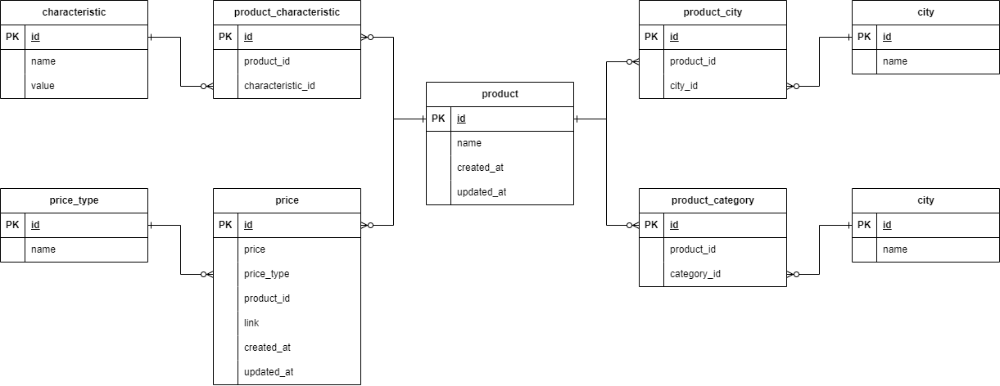

# 🧑‍💻 Testing task for Lad

## ⚙️ Setting up:
1. Создать файл `.env` согласно шаблону `.env.sample`:
```env
DB_DRIVER=postgresql+asyncpg
DB_USER=postgres
DB_PASSWORD=postgres
DB_HOST=localhost
DB_PORT=5432
DB_NAME=ladtest
```
2. Создать и активировать виртуальное окружение python
3. Установить зависимости
```console
pip install -r requirements/requirements.txt
```

## ▶️ Run the app:
Запустить файл `run.py`
```console
python run.py
```
## 📖 Description:
- Директория `./src` содержит в себе исходный расширяемый код для работы с БД.
- Директория `./migrations` содержит в себе ревизии для alembic-миграций.
- `db_filling_example.py` - содержит в себе функцию `fill_tables_example` с кодом для тестового заполнения БД.
- `run.py` содержит в себе функцию `main`, которая инициализирует БД, заполняет её и выводит результаты 2-х запросов к БД: 
  - Получение перечня всех товаров с их новейшей ценой.
  - Получение всей информации о всех товарах в БД используя selectinload() опцию подкачки данных.
- ER-диаграммма:

## 🤔 Task:
### 1 задание

Создать таблицы и выстроить между ними связи для следующих сущностей:
1. Товар
    - Название товара
    - Дата добавления
    - Дата обновления
2. Город
   - Название города
3. Категория товара
   - Название категории
4. Характеристика товара
   - Название характеристики
   - Значение характеристики
5. Цена товара
   - Цена
   - Тип цены (розничная/скидка/оптовая/)
   - Ссылка на страницу с ценой на товар
   - Дата добавления
   - Дата обновления
### 2 задание
Сделать инициализирующую миграцию для БД.
### 3 задание
Написать SQL запрос, который получает из базы данных перечень всех товаров с их новейшей ценой.

Требования:
1. В качестве БД использовать PostgreSQL
2. Использовать SQLAchemу для создания моделей
3. Для создания миграции использовать alembic
4. Для SQL запросов использовать ORM SQLAlchemy, "сырые" запросы нужны
не